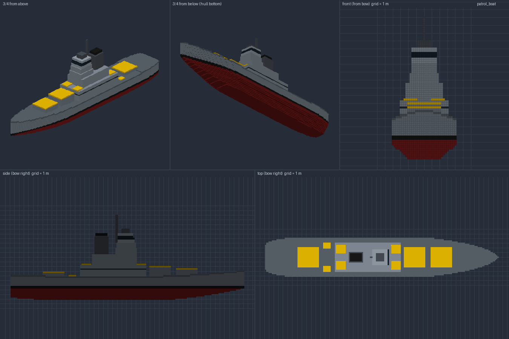
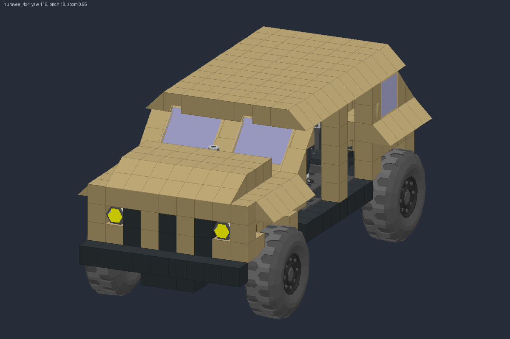
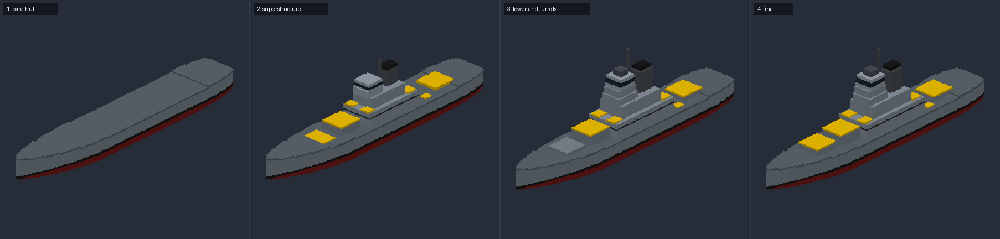
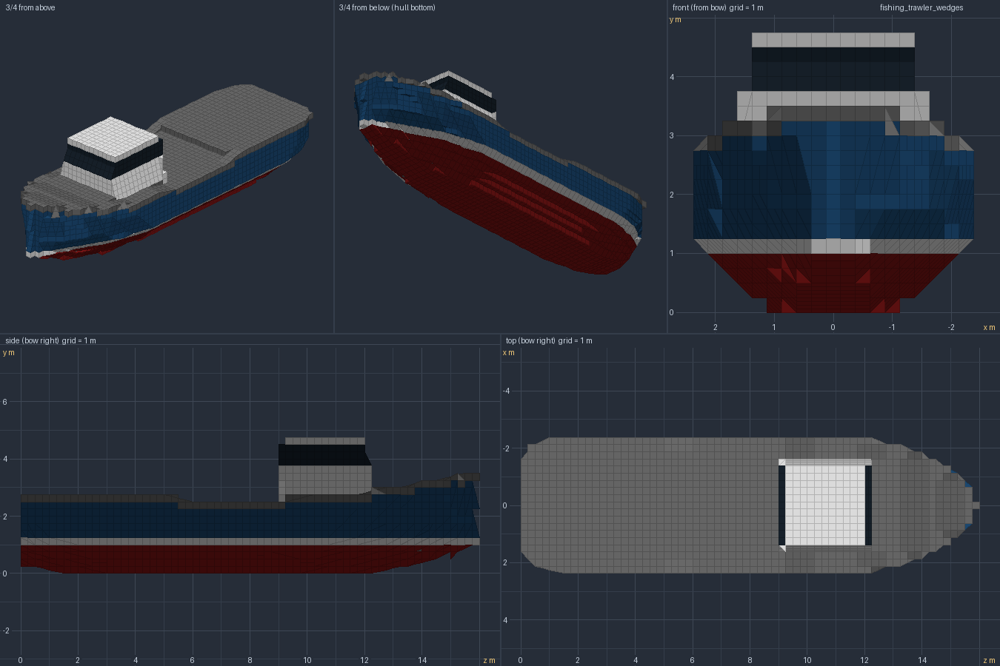
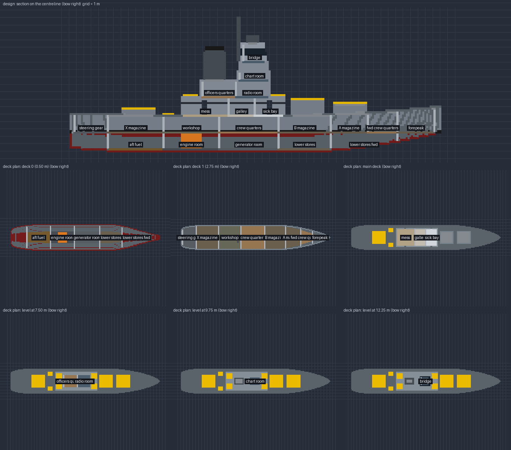
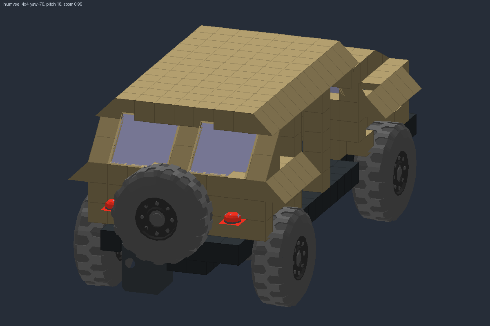
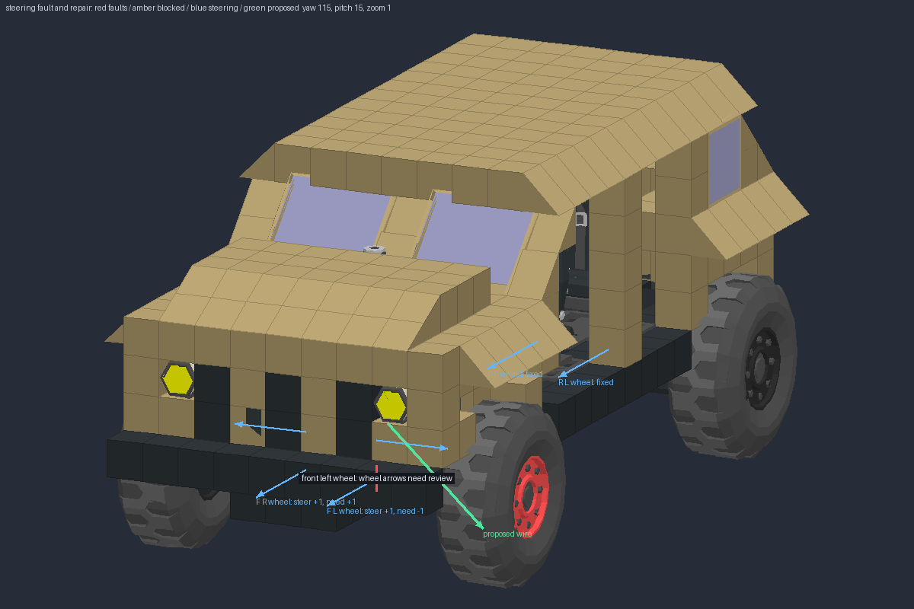
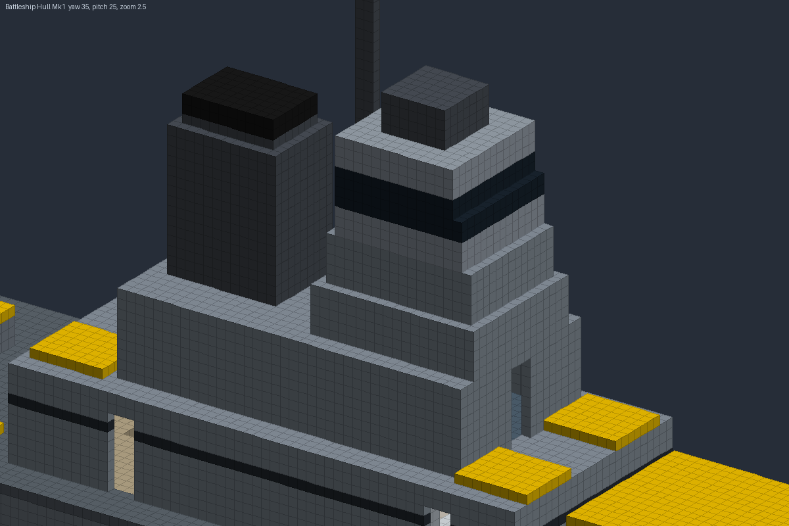
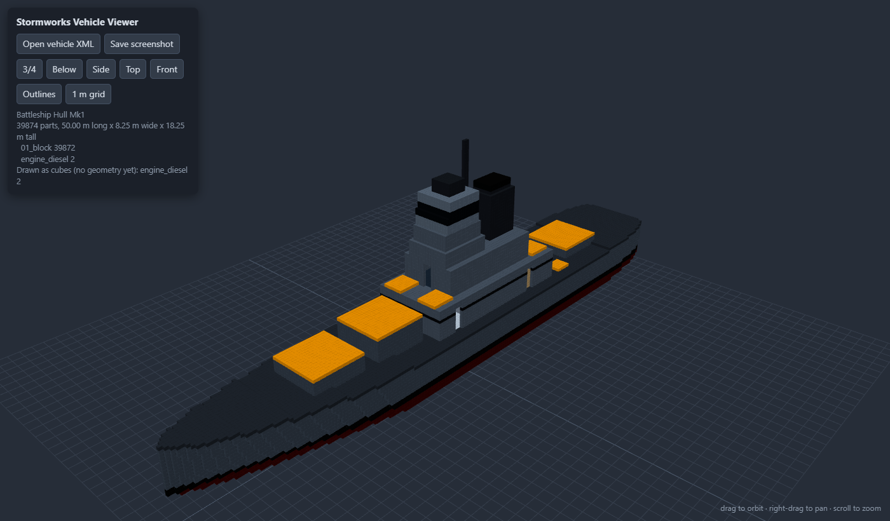

# Stormworks MCP

Describe a vehicle to your AI assistant and get a file you can load in
[Stormworks: Build and Rescue](https://store.steampowered.com/app/573090/). Stormworks MCP is a
local [MCP](https://modelcontextprotocol.io) server for Claude Desktop and the ChatGPT / Codex
Windows app. It gives the assistant tools to shape boat hulls, lay out interiors, assemble road
vehicles from your installed parts, wire and plumb them, and find faults. The assistant checks its
own work in rendered previews, then saves the vehicle to your Stormworks vehicles folder, ready to
load at a workbench.

Everything runs on your PC. The server reads part definitions from your own game install and never
modifies the game.

**[Download for Windows](https://github.com/macery12/Stormworks-MCP/releases)** ·
[Run from source](#run-from-source) · [Building walkthrough](docs/building.md) ·
[What is verified in game](docs/in-game-testing.md)

<p>
  
  
</p>

## What you can build

Every change comes back as a picture. The assistant compares it with your request, fixes what is
off, and shows you the next version before anything is saved.

### Boats and ships

Pick one of 10 hull archetypes (runabout, rowboat, fishing trawler, tugboat, motor yacht, landing
craft, lifeboat, patrol boat, catamaran or barge) and adjust its length, beam, deadrise, bow shape,
sheer and flare. Add superstructure from boxes, cylinders, domes and lattice masts; each shape can be
pitched, yawed, mirrored to both sides, repeated in rows, or stacked on another by name. Bulbous
bows, skegs, hull numbers, deck markings and painted panels are also available. To model a real
ship, enter its dimensions with `scale: "1:4"`, or use `scale: "fit"` to size a design to your
workbench.

The battleship above took four passes:



Hulls are plain blocks by default. `smoothing: "wedges"` skins them with the game's slope pieces
(Wedge, Pyramid and Inverse Pyramid in every size). `smoothing: "wedges_v2"` adds a refinement pass
and keeps the original fit when the refined one adds seams or drifts too far from the shape.
Neither mode has been confirmed in game yet; see [hull smoothing](docs/hull-smoothing.md).



### Interiors

Add decks, bulkheads and rooms with 0.75 m × 2 m doorways. `preview_interior` draws a section down
the centreline and a labelled plan of every level. It reports each room's clear size, floor width,
headroom and doors, and warns when something does not fit, such as an engine too tall for its room.
In the access stage, the builder fits real manual doors and complete hatch-and-ladder assemblies
wherever the whole part fits. A request that cannot fit leaves the wall or floor sealed; the builder
never cuts an unfinished hole for you to fill later.



### Road vehicles

Start a land vehicle from a preset or a bare chassis, assembled from the parts installed in your
game:

| Preset | What you get |
| --- | --- |
| `utility_buggy` | Saddle-seat buggy with four suspension wheels, lights, an engine, premade fuel tanks, a battery and a radiator. The parts are mounted but not connected. |
| `utility_4x4` | Four-seat 4x4 with sliding doors and a prebuilt diesel, radiator, fuel tank and battery, all piped and wired. Includes steering, throttle, brake, starter, light and reverse controls. |
| `humvee_4x4` | Four-seat, Humvee-shaped 4x4 with the same connected systems, open bays for your own doors, and enclosed pipes under the floor. |
| `chassis` | A bare chassis at your own dimensions, to extend part by part. |

The assistant can also read your saved vehicles for wheel and track layouts to learn from. Previews
use the game's own part models, and can hide the bodywork to check seats, tanks and the powertrain.



### Wiring, pipes and repairs

Connect signal and electric wires between part ports, and route real pipes between fluid faces,
either exposed or enclosed in blocks. Four reusable control assemblies (engine start and idle,
clutch, brake and reverse, lighting) bind to the parts you choose. `preflight_vehicle` checks the
fuel, air, exhaust and cooling paths, the driveline, electrical power and controls.
`plan_vehicle_repairs` turns each finding into a fix you can preview before applying, with the
problem drawn over the vehicle:



Before you test, `prepare_vehicle_validation` exports a separate copy with a seven-point in-game
checklist tied to that exact file. See [diagnose, repair and verify](docs/vehicle-repair.md).

### Edits to new and existing vehicles

Edit single blocks or whole regions in batches: add, fill, move, rotate, paint, copy, mirror or
repeat. Each batch can be previewed before you commit it, and undone afterwards. Import one of your
own vehicles into a separate draft to repaint or extend it; the original file is never changed.
`check_seal` traces each compartment to the outside and highlights any leak path.

### Inspection from any angle

`inspect_view` points a camera at any detail, at any angle and zoom. `open_in_viewer` opens the
vehicle in an interactive 3D viewer in your browser. The viewer, [viewer/index.html](viewer/index.html),
also works on its own with any vehicle file.

<p>
  
  
</p>

## Install

### Windows desktop app (recommended)

You need Windows 10 or 11 (x64), Stormworks installed through Steam, and Claude Desktop or the
ChatGPT / Codex Windows app on the same PC. The download includes Python and every dependency; you
do not need to install Python, uv or Git.

1. Download `stormworks-mcp-0.1.0-windows-x64.exe` from
   [Releases](https://github.com/macery12/Stormworks-MCP/releases).
2. Move it to a permanent folder and double-click it. There is no installer.
3. Close your AI client. In the app, open **MCP > Set up Claude Desktop** or
   **MCP > Set up ChatGPT / Codex**, check the configuration path it shows, and press
   **Add to client**. Your other settings are kept, and the file is backed up first. To replace an
   existing Stormworks entry, tick the replacement checkbox.
4. Press **Start server**, then open your client again.

The window shows the server status and a live log. Keep it open while you build: every client
connects to this one shared server, and closing the window stops it and disconnects them. After you
start the server again, reconnect or restart your client. A second copy of the app refuses to start.

For other clients, **MCP > Custom client / raw configuration** copies MCP JSON, Codex TOML or a
PowerShell add command. The **View** menu has diagnostics and log copy/clear. Setup records the
EXE's current location, so if you move the file, reopen it and replace its client entries.

The same configuration serves Codex CLI and the IDE extension on that PC. ChatGPT on the web and
cloud tasks use a separate connection path that this app does not set up; see
[OpenAI's MCP guide](https://learn.chatgpt.com/docs/extend/mcp?surface=app). To check that a
download was built from this repository, see [verify a download](docs/releases.md#verify-a-download).

**Upgrading from an older setup:** close your clients and any older server, replace the EXE, and use
the replacement checkbox to update each client entry to `--connect`. Remove any duplicate Stormworks
entry or extension. Entries that launch `server.py` directly start their own separate server and
must be replaced to use the shared one.

### Run from source

You need Windows with Stormworks installed through Steam (tested on Windows 11), a supported client,
and [uv](https://docs.astral.sh/uv/getting-started/installation/), which installs Python and the
dependencies for you.

```bash
git clone https://github.com/macery12/Stormworks-MCP.git
cd Stormworks-MCP
uv sync --locked
```

Open the desktop window from the repository root, set up your client from the **MCP** menu, and
press **Start server**:

```powershell
uv run python launcher.py
```

To configure a client yourself, print the exact configuration for this checkout:

```powershell
uv run python launcher.py --config json      # MCP JSON
uv run python launcher.py --config toml      # Codex TOML
uv run python launcher.py --config command   # codex mcp add command
uv run python launcher.py --doctor           # check paths and game assets without changing files
```

For Claude Desktop, open **Settings > Developer > Edit Config** and add a `stormworks-hulls` entry
under `mcpServers`, using the folder you cloned into:

```json
{
  "mcpServers": {
    "stormworks-hulls": {
      "command": "C:\\path\\to\\Stormworks-MCP\\.venv\\Scripts\\python.exe",
      "args": ["C:\\path\\to\\Stormworks-MCP\\launcher.py", "--connect"]
    }
  }
}
```

`--connect` relays to the running desktop server and never starts one, so keep the window open with
the server running. Quit and reopen the client after changing its configuration. For Claude Desktop,
right-click the tray icon and choose **Quit**; in the ChatGPT / Codex app, check the entry under
**Settings > MCP servers** and restart its connection.

## Build your first vehicle

1. Start a new chat and ask:

   > List the Stormworks hull presets.

   The assistant calls `list_hull_presets` and lists 10 archetypes, from `runabout` to `barge`. If
   the tool is missing, check the server entry under Claude's **Settings > Developer** or the
   ChatGPT / Codex app's **Settings > MCP servers**, and check the desktop app's log.

2. Ask for a boat:

   > Design me a chunky fishing boat for bench size S. Show me a preview, then save it.

   The assistant reads the design guide, previews and refines the hull, and saves it.

3. In Stormworks, open a workbench, choose **Load**, and pick the name the assistant gave the
   vehicle.

Load it and check it against the [in-game checklist](docs/in-game-testing.md#checking-a-boat): many
features have not been verified in game yet. The [building walkthrough](docs/building.md) covers
stages, units and exact edits.

## Example prompts

**Boats**

- "Give me three different 10 m rescue boat hulls and show them side by side."
- "Take the tugboat preset but make it longer and sleeker, like a pilot boat."
- "Add an interior: engine room aft with a large engine, crew quarters amidships, and a bridge."
- "Try it with wedge smoothing" or "open it in the viewer".
- "Build the tugboat through the propulsion stage, show every automatic choice, then save it."

**Road vehicles**

- "Build the Humvee preset for bench S, then show me the equipment with the bodywork hidden."
- "Find the wheeled vehicles in my saves and compare their wheelbases."
- "Run preflight on my 4x4 and preview the repairs before applying any."
- "Export a test copy of the 4x4 and give me the in-game checklist."

**Existing vehicles**

- "Look at my vehicle 'Old Trawler' and design a new hull in the same style."
- "Import Old Trawler into a draft, repaint the bridge, and save a separate copy."
- "Add a block-built diesel tank, check its enclosure, and show the outlet and vent connections."

## Tools

You do not call these yourself: describe what you want, and the assistant picks the tools. Before
building, it reads `hull_design_guide` for boats (`topic="workflow"` returns a short starting guide)
or `land_vehicle_guide` for road vehicles. Hull dimensions are in metres; exact edits use integer
blocks of 0.25 m. Saving refuses to overwrite a vehicle file the server did not create, and replacing
one it did create needs `overwrite=true`.

| Area | Tools | Guide |
| --- | --- | --- |
| Guides and setup | `hull_design_guide`, `land_vehicle_guide`, `get_runtime_status`, `list_workbenches` | [Building](docs/building.md) |
| Hull design | `list_hull_presets`, `get_hull_spec`, `preview_hull`, `preview_interior`, `deck_profile`, `save_hull` | [Building](docs/building.md) |
| Designs and drafts | `store_design`, `list_designs`, `load_design`, `import_vehicle`, `preview_vehicle`, `save_vehicle` | [Staged builder](docs/staged-builder.md) |
| Part editing | `query_parts`, `edit_parts`, `undo_edits` | [Staged builder](docs/staged-builder.md) |
| Road vehicles | `create_land_vehicle`, `find_land_vehicles`, `search_land_parts`, `analyze_land_vehicle` | [Land vehicles](docs/land-vehicles.md) |
| Wiring and pipes | `query_connections`, `edit_connections`, `route_connections`, `list_vehicle_assemblies`, `apply_vehicle_assembly` | [Vehicle repair](docs/vehicle-repair.md) |
| Faults and repairs | `preflight_vehicle`, `plan_vehicle_repairs`, `repair_vehicle`, `preview_vehicle_diagnostics`, `check_seal` | [Vehicle repair](docs/vehicle-repair.md) |
| In-game test records | `prepare_vehicle_validation`, `record_vehicle_validation`, `get_vehicle_validation`, `get_calibration_observations` | [In-game testing](docs/in-game-testing.md) |
| Part catalogue | `search_parts`, `get_part_definition`, `get_part_orientation` | [Staged builder](docs/staged-builder.md) |
| Inspection and analysis | `inspect_view`, `open_in_viewer`, `list_game_vehicles`, `preview_game_vehicle`, `analyze_vehicle`, `analyze_hull`, `suggest_hull_blocks` | [Hull smoothing](docs/hull-smoothing.md) |
| Issue reports | `complaint`, `list_complaints`, `get_complaint` | Saved locally as JSON and Markdown |

## Configuration

A standard Windows and Steam install needs no configuration. To override a default, set these
environment variables before starting the desktop app:

| Variable | Default | Used for |
| --- | --- | --- |
| `SW_VEHICLES_DIR` | `%APPDATA%\Stormworks\data\vehicles` | Where vehicles are read and saved. |
| `SW_GAME_DIR` | Found through your Steam libraries | Stormworks install, for part definitions and workbench locations. |
| `SW_DEFINITIONS_DIR` | `<game>\rom\data\definitions` | Part definitions directly. |
| `SW_WORKSHOP_DIR` | Found through your Steam libraries | Installed workshop vehicles used as references. |
| `SW_DESIGNS_DIR` | `%APPDATA%\stormworks-hull-mcp\designs` | Stored designs and drafts. |
| `SW_COMPLAINTS_DIR` | `%APPDATA%\stormworks-hull-mcp\complaints` | Local JSON and Markdown issue reports. |
| `SW_TOOL_TIMEOUT` | `300` | Seconds a build or render may run before the server stops it. |
| `SW_BUILD_CACHE` | `1` | Set to `0` to turn off geometry caching. |
| `SW_BUILD_CACHE_DIR` | `%TEMP%\stormworks-mcp-builds` | Shared geometry cache, capped at 20 entries / 512 MiB. |
| `SW_MCP_PORT` | `38473` | Loopback port of the shared desktop server (1024 to 65535). |
| `SW_MCP_RUNTIME_DIR` | `%LOCALAPPDATA%\stormworks-hull-mcp\runtime` | Runtime files of the shared desktop server. |

Without game definitions, plain blocks, slopes and structural editing still work. Installed
components need definitions: automatic fit-out reports what it skipped, and a seal check that meets
unknown component geometry reports the result as indeterminate.

## Status and limitations

This is an early release (0.1). The server writes files without running the game, so the game is the
only real test. [In-game testing](docs/in-game-testing.md) tracks the status of every feature.

- **Verified in game:** vehicles load centred in the workbench, blocks-only hulls float, and Wedge
  1x1/1x2/1x4, Pyramid and Inverse Pyramid rotate correctly in all 40 tested orientations.
- **Player-tested, with a fix awaiting a check:** the connected Humvee's controls, engine and
  steering work, but W drove it backward because the gearbox's off ratio was reverse. The
  replacement cube gearbox has not been checked in game yet.
- **Not yet verified in game:** both smoothing modes and the larger Pyramid sizes; interiors, doors
  and hatches; placed components and block-built tanks; seal checks; round and angled shapes,
  bulbous bows, skegs and paint; and operating the utility buggy and utility 4x4.
- **Placed parts are not a working system.** The boat fit-out stages and the utility buggy place
  engines, tanks, propellers and rudders without connecting them. Add pipes and wires with the
  connection tools, then test in game.
- **Nothing is simulated.** Preflight checks that paths and links exist; it does not simulate
  physics, fluid flow, engine load or driving. Control logic comes from the connected 4x4 presets
  and the four control assemblies.
- **Imports** accept single-body, version-3 vehicles only. Some configured original parts can only
  be repainted. Save the result under a new name.
- **Paint** is one colour per block, so hull blocks show their outside colour inside rooms.
- **Large designs:** a 118 m, 184k-part ship previews in about 15 s, or about 35 s with wedge
  smoothing. The game appears to drop components past 131,072 on spawn; this is not yet confirmed.
- **The 3D viewer** loads three.js from a CDN, so it needs internet access.

## How it works

A hull spec describes a continuous shape: plan-view taper, keel rise, sections with deadrise and
bilge radius, sheer, and superstructure. The server voxelizes that shape at 0.25 m per block, hollows
it to a watertight skin, adds interior structure, and can skin it with slope pieces. Once stored, any
design (hull, land or imported) can be changed part by part: the editing, connection and repair tools
apply revision-checked batches with undo. The result is written as Stormworks vehicle XML. Previews
are drawn in Python with Pillow from the same geometry, using the installed component meshes.

Heavy builds and renders run in a child process that the server stops when a call is cancelled or
exceeds `SW_TOOL_TIMEOUT`, so one slow ship cannot stall later calls.
[docs/vehicle-format.md](docs/vehicle-format.md) documents the file format, including the details
that are easy to get wrong: a missing `r` attribute is not the identity rotation, `x` in the paint
string means unpainted, and the game's axes are left-handed.

## Documentation

| Guide | Read it to |
| --- | --- |
| [Building walkthrough](docs/building.md) | Make a first build, keep units straight, edit exactly and diagnose a result. |
| [Staged builder](docs/staged-builder.md) | Build in stages, edit parts, import vehicles, and add components, access, seals and tanks. |
| [Land vehicles](docs/land-vehicles.md) | Use the land presets, the chassis spec, parts, connections and preflight. |
| [Diagnose, repair and verify](docs/vehicle-repair.md) | Repair faults, apply control assemblies and record in-game tests. |
| [Hull smoothing](docs/hull-smoothing.md) | Choose slope pieces and check hull depth. |
| [In-game testing](docs/in-game-testing.md) | Check a vehicle in game and see what is verified. |
| [Vehicle file format](docs/vehicle-format.md) | Read or write Stormworks vehicle XML from your own tools. |
| [Releases](docs/releases.md) | Verify a download, build the EXE locally or publish a release. |
| [Advanced testing](docs/advanced-testing.md) | Run placement suites, analyze reference vehicles and generate calibration exhibits. |

## Development

```bash
uv sync --locked                  # install locked dependencies, including pytest and ruff
uv run pytest                     # unit tests; engine tests skip when the game is not installed
uv run ruff check .               # lint
uv run tools/smoke_test.py out    # build and render every preset in both modes into ./out
uv run tools/client_test.py       # drive the server over MCP stdio, like Claude Desktop does
uv run tools/staged_builder_test.py out/staged-builder --benchmark
uv run tools/diagnostic_milestone.py out/diagnostic-review  # three-fault repair milestone
uv run python tools/package_test.py # two clients, shared host, guide assets, workers, export and stop
```

On Windows, build the portable desktop executable:

```powershell
uv sync --locked --group build
uv run --group build python tools/build_windows.py
uv run python tools/package_test.py --exe dist/stormworks-mcp.exe
uv run python tools/desktop_test.py --exe dist/stormworks-mcp.exe
```

Tagging `v0.1.0` (or `v0.1`) runs the tests, builds and tests the executable, and uploads it to a
draft GitHub release with checksums and signed build provenance; see
[releasing and verification](docs/releases.md). Changes must pass lint and tests. Geometry changes
also need a rendered review and a specific in-game check, as described in [CLAUDE.md](CLAUDE.md).

Design notes and history: [feature requests and bugs](docs/feature-requests.md),
[project audit](docs/project-audit.md), [hull smoothing research](docs/hull-smoothing-research.md)
and [surface design plan](docs/surface-design-plan.md).

| Path | Contents |
| --- | --- |
| [server.py](server.py) | MCP tool definitions |
| [launcher.py](launcher.py) | Desktop app entry point and `--connect` client relay |
| [swhull/hull.py](swhull/hull.py), [presets.py](swhull/presets.py) | Hull spec to solid voxels; the 10 archetypes |
| [swhull/smooth.py](swhull/smooth.py) | Hollow, watertight skin and slope-piece fitting |
| [swhull/interior.py](swhull/interior.py), [access.py](swhull/access.py) | Decks, rooms and doorways; complete doors and hatches |
| [swhull/components.py](swhull/components.py), [tanks.py](swhull/tanks.py) | Component fit-out; block-built fluid tanks |
| [swhull/land_build.py](swhull/land_build.py), [land_presets.py](swhull/land_presets.py) | Land chassis and presets |
| [swhull/networks.py](swhull/networks.py), [routing.py](swhull/routing.py) | Typed wiring and preflight; pipe routing |
| [swhull/repairs.py](swhull/repairs.py), [assemblies.py](swhull/assemblies.py), [validation.py](swhull/validation.py) | Repair suggestions, control assemblies and in-game test records |
| [swhull/editing.py](swhull/editing.py), [drafts.py](swhull/drafts.py) | Transactional part edits and lossless imports |
| [swhull/seal.py](swhull/seal.py) | Compartment air connectivity |
| [swhull/pieces.py](swhull/pieces.py), [vehicle.py](swhull/vehicle.py) | Piece geometry and the rotation convention; vehicle XML |
| [swhull/render.py](swhull/render.py), [meshes.py](swhull/meshes.py) | PNG previews using installed component meshes |
| [swhull/definitions.py](swhull/definitions.py), [benches.py](swhull/benches.py) | Game install detection, part definitions and workbench sizes |
| [swhull/jobs.py](swhull/jobs.py), [cache.py](swhull/cache.py) | Killable worker processes; shared geometry cache |
| [swhull/setup_gui.py](swhull/setup_gui.py), [desktop_runtime.py](swhull/desktop_runtime.py) | Desktop window and shared server |
| [swhull/guide.md](swhull/guide.md) | Design guide served by `hull_design_guide` |
| [viewer/](viewer) | Standalone 3D viewer |
| [tools/](tools) | Smoke, client, package and desktop tests; in-game calibration vehicles |

## License

[MIT](LICENSE). This is an unofficial fan project, not affiliated with or endorsed by Geometa, the
developer of Stormworks. It modifies no game files and ships no game assets; part definitions are
read from your own install at runtime.
