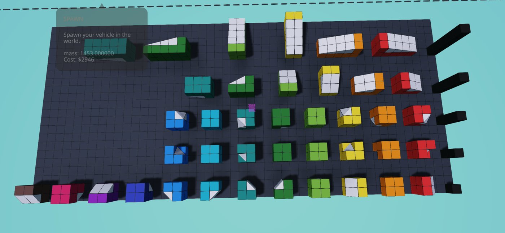

# In-game testing

This project writes Stormworks files without running the game, so the game is the only real test.
This page explains how to check generated vehicles in game, and what has been checked so far.

## What has been verified

| Feature | Status |
| --- | --- |
| Vehicles load and sit centred in the workbench | Verified |
| Blocks-only hulls float | Verified (runabout and tugboat test hulls) |
| Paint on every surface | Fixed after testing: `x` in `sc` means unpainted |
| Rotation of every slope piece | Verified for Wedge 1x1/1x2/1x4, Pyramid and Inverse Pyramid: all 40 orientations in `hull test orientations` |
| Pyramid and Inverse Pyramid 1x2, 1x4, 2x2, 2x4, 4x4 | Not yet verified in game: load `hull test orientations 2`. Their shapes are read from the game's definition files and checked by tests |
| Wedge smoothing (`smoothing: "wedges"`) | The old fitter floated. Rewritten to use every slope piece (2026-10-01), including mirrored Pyramid 2x4 / Inverse Pyramid 2x4 (`t` read from a save made with mirror mode); not yet loaded in game |
| Interiors (rooms, doors, hatches) | Not yet verified in game |
| Placeholder engines | Not yet verified in game |
| Cylinders, domes, spheres, lattice masts | Not yet verified in game |
| Pitched and yawed parts (barrels, raked masts) | Not yet verified in game: check thin diagonals stay attached |
| Bulbous bow, skegs | Not yet verified in game: check the hull still floats level |
| Paint (`paint`: text, circles, rectangles) | Not yet verified in game: check side text reads correctly from both sides |
| `floors` (2.25 m headroom per floor) | Not yet verified in game: check the player can walk upright |
| Spawn limit of 131,072 components | Seen once: USS Iowa V2 (184k parts) loaded whole in the editor but lost everything past component 131,072 on spawn. Confirm with `hull test component limit` |
| `facing: "aft"` parts | Not yet verified in game |

## Test vehicles

Two scripts write test vehicles straight into your vehicles folder. All fit the starter
workbench except `hull test orientations 2`, which needs bench size M or larger.

```bash
uv run tools/orientation_test.py     # writes "hull test orientations" and "... 2"
uv run tools/calibration.py          # writes "hull test calibration" and "... corners"
```

Load one from any workbench (Load, then pick the name).

### hull test orientations

Every piece orientation the wedge smoother can use, each shown as a white piece in a coloured
bracket of blocks. A correct piece sits flush and reads as a clean ramp or chamfered corner. A
wrong piece sticks out, floats, or leaves a hole.



- Rows are marked by a black pillar. Its height in blocks gives the row: 1 wedge, 2 pyramid,
  3 inverse pyramid, 4 Wedge 1x2, 5 Wedge 1x4.
- Bracket colours run from the pillar: red, orange, yellow, lime, green, teal, cyan, blue,
  indigo, purple, pink, brown.
- [tools/orientation_legend.json](../tools/orientation_legend.json) maps each vehicle, row and
  colour to its `r` value. A report such as "row 2, teal is wrong" points to one rotation.

### hull test orientations 2

The same layout for the larger corner pieces, six orientations each (four lying on the floor,
one on a wall, one hanging): rows 1 Pyramid 1x2, 2 Inverse Pyramid 1x2, 3 Pyramid 1x4,
4 Inverse Pyramid 1x4, 5 Pyramid 2x2, 6 Inverse Pyramid 2x2, 7 Pyramid 2x4, 8 Inverse Pyramid
2x4, 9 Pyramid 4x4, 10 Inverse Pyramid 4x4. Each white piece should sit flush in its bracket
with its sloped face open; a gap, an overlap or a slope facing into the bracket is wrong.

### hull test component limit

`uv run tools/component_limit_test.py` writes a flat plate of 135,360 blocks (36 x 117.5 m,
bench size XL or larger). Components come in grey bands of 8,192; everything after component
131,072 is a red strip at one end. Spawn it: if the red strip disappears and the grey stays
whole, the game spawns at most 131,072 components. If the cut lands elsewhere, count the grey
bands that survive.

### hull test calibration

Five shapes on one plate, with each piece type in its own colour: grey block, green wedge,
blue Wedge 1x2, purple Wedge 1x4, yellow pyramid, orange inverse pyramid. It should read as a
45° hip roof, a 45° funnel, a 1:2 roof laid in Wedge 1x2, a 1:4 roof laid in Wedge 1x4, and a
faceted diamond. It shows how the wedge smoother handles simple slopes.

`hull test calibration corners` has five low diamonds whose faces need the larger corner
pieces (teal Pyramid 4x4, light cyan Pyramid 2x2, pale yellow Pyramid 1x2, and so on; the
colours are in [tools/calibration.py](../tools/calibration.py)). Faces should read as flat
planes; the ridges between faces run through the middle of a block row and stay stepped.

## Checking a boat

1. Save it with Claude (`save_hull`), or run `uv run tools/smoke_test.py out` to write every
   preset into `./out`, then copy files into your vehicles folder.
2. Load it at a workbench large enough for it. The preview report says whether it fits its
   `bench` size and lists every size it fits.
3. Look for pieces that stick out or leave gaps.
4. Spawn it in water and check that it floats level and does not take on water.

When something looks wrong, a screenshot plus the vehicle name is enough to trace it.
